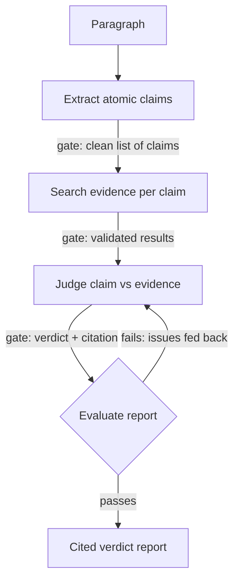

# PromptProof

[](https://github.com/HelloJahid/PromptProof/actions/workflows/ci.yaml)
[](LICENSE)
[](https://www.python.org/)
[](https://github.com/astral-sh/ruff)

> A self-correcting prompting engine that verifies information by chaining focused prompts,
> gate-checking every step with Pydantic, grounding claims with a live search tool, and looping
> an evaluator until the verdict holds up.

PromptProof turns a single prompt into a reliable, multi-step workflow. The engine is the focus
of the project; the task it performs is a small, well-defined job that gives it something real to
do. That task is a **grounded claim checker**: you paste a short paragraph, and the engine breaks
it into atomic claims, checks each against live web evidence, and returns a verdict for every
claim (**Supported**, **Refuted**, or **Unverifiable**) with a citation.

## The four mechanisms

| Mechanism | What it does | Where |
|---|---|---|
| **Prompt chaining** | Decomposes the task into focused steps: extract → search → judge. | [`engine/chain.py`](engine/chain.py) |
| **Pydantic gate checks** | Validates each intermediate output against a schema, with halt / retry / retry-with-feedback. | [`engine/gates.py`](engine/gates.py) |
| **Gate-checked ReAct tool** | A web-search call whose raw response is schema-validated with controlled retry, so a broken observation never corrupts the chain. | [`engine/tools.py`](engine/tools.py) |
| **Feedback loop** | A rule-based evaluator reviews the whole report against criteria and loops until it passes or hits a cap. | [`engine/feedback.py`](engine/feedback.py) |

A `RunTrace` ([`engine/trace.py`](engine/trace.py)) records every step, attempt, retry reason,
token count, and timing, and failures surface as typed errors ([`engine/errors.py`](engine/errors.py))
the engine can reason about instead of crashing. The model client and the search transport are
both injectable, so the engine can run entirely against mocks for offline development.

## Architecture



## Install

Requires Python 3.11+ and an [Anthropic](https://console.anthropic.com/) API key (plus a free
[Tavily](https://tavily.com/) key for live web search).

```bash
python -m venv .venv
# Windows: .venv\Scripts\activate   |   macOS/Linux: source .venv/bin/activate

# Option A — pinned requirements
pip install -r requirements.txt          # core engine + CLI
pip install -r requirements-gui.txt      # optional: the Streamlit GUI

# Option B — as a package (adds the `promptproof` command)
pip install -e ".[gui]"

cp .env.example .env                      # then add ANTHROPIC_API_KEY and TAVILY_API_KEY
```

## Usage

### CLI

```bash
promptproof "The Sydney Opera House was designed by a Danish architect and opened in 1973."
# or, without installing the package:
python -m app.cli "..." --trace          # --trace prints the per-step run trace
```

### GUI

```bash
streamlit run app/gui.py                 # opens http://localhost:8501
```

Pick a model and run a check; verdicts come back with sources and an expandable run trace.

## Project structure

```
engine/            The prompting engine (the focus of the project)
  chain.py         orchestrates extract -> search -> judge -> evaluate (+ revise loop)
  gates.py         Pydantic schemas + generate_and_validate (halt/retry/retry-with-feedback)
  tools.py         gate-checked, retrying web search (injectable transport)
  feedback.py      rule-based evaluator + revision feedback
  llm.py           thin model abstraction with an injectable client (mock mode)
  trace.py         RunTrace observability spine
  errors.py        typed GateFailure / ToolFailure
  prompts/         one prompt template per step (role/task/format/examples/context + CoT)
  steps/           extract and judge step functions
app/               minimal interfaces: cli.py (terminal) and gui.py (Streamlit)
```

## Background

This project is the build that accompanies a two-part series on reliable prompting systems.
Part one covers the ideas:
[Clever Prompts Are Cheap Now. Reliable LLM Prompting Systems Are the Skill.](https://medium.com/towards-artificial-intelligence/clever-prompts-are-cheap-now-reliable-llm-prompting-systems-are-the-skill-4229e147ebaf)
Part two is this repository.

## License

[MIT](LICENSE)
